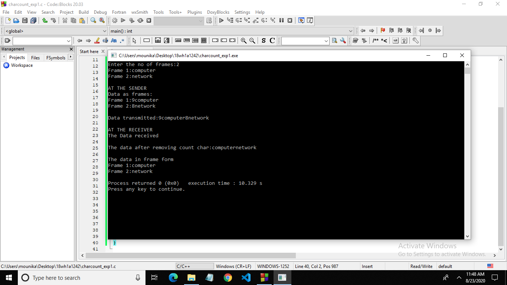
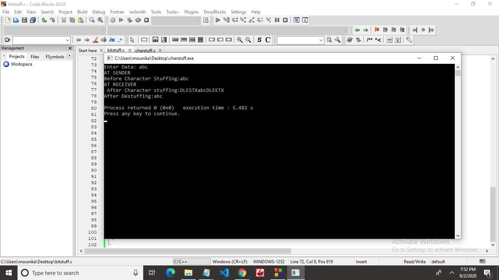
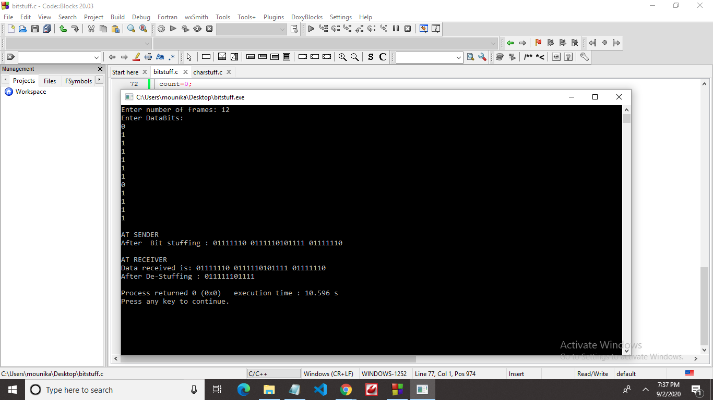

# Experiment 1

## Aim of the Experiment
To implement data link layer framing method character count.

### Procedure for Character Count
1. First scan the number of frames required.
2. Scan the frames.
3. Find string length of each frames
4. Print the Frames at Sender.
5. Print  the Data Transmitted.
6. Print the frames at Receiver.

###Output

## Aim of the Experiment
Character stuffing

### Procedure for Character Stuffing

1.Read the number of frames and data in each frame.
2.At the sender side, add the starting delimiter as "DLESTX" and ending delimiter as "DLEETX".If the original data contains "DLE" as sub-string, add an extra "DLE" before it.
3.At the receiver side, remove the delimiters and extra "DLE's" added at the sender side.This becomes the original data sent by the sender.
4.we use delimiters to help receiver know start and end points of the data sent.

###OUTPUT:

 
 
## Aim of the Experiment
Bit stuffing

###Procedure for Bit Stuffing

1.Read the number of frames and data in each frame.
2.In the data, if five consecutive ones are encountered, stuff zero after them so that they are not considered as flag bits by the receiver.
3.At the sender side, add flag bits at the start and end of stuffed data and send it to the receiver.
4.At the receiver side, de-stuff the received data and remove the flag bits.
5.This becomes the original data sent by the sender.
###OUTPUT :

